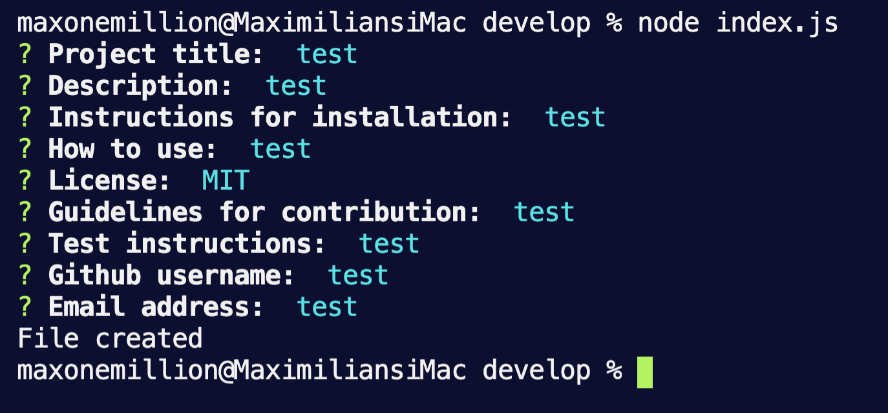

# README-Generator

## PURPOSE
This is a command-line application that dynamically generates a professional README.md from a user's input using the Inquirer package.

## INSTALLATION
To install necessary dependencies, run these commands:
```
npm install + npm install inquirer
```
## USAGE
Use this application when you need to include a README.md.   [Here](https://drive.google.com/file/d/1uVSKajFOKh62oqJgqAZ6lnaHGjgzTZ2P/view?usp=sharing "Link to video showing how to use this app") is a short video showing how to use this application.

### RUN
 
Walkthrough video: https://drive.google.com/file/d/1uVSKajFOKh62oqJgqAZ6lnaHGjgzTZ2P/view?usp=sharing
Github repository: 
